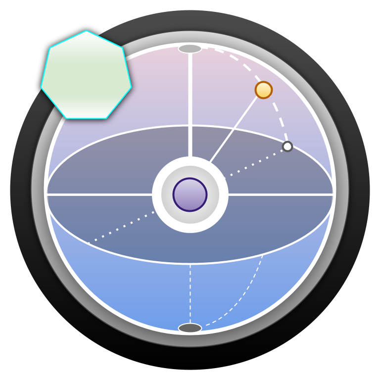

# aloecrypt_core

<div align="center">



**Post-quantum cryptographic primitives with auto-generated language bindings**

[](https://github.com/Aloecraft-org/aloecrypt_core)
[](https://opensource.org/licenses/Apache-2.0)

Implements ML-KEM (FIPS 203), ML-DSA (FIPS 204), ChaCha20-Poly1305 password encryption, SHAKE-256 key derivation, and Keccak-256 hashing.
</div>

## Structure

```
api_core.json          Schema driving all code generation
build.rs               Generates src/api_core.rs at compile time (Rust types, traits, consts)
generator/gen_py.py    Generates Python bindings from the same schema
src/
  lib.rs               no_std library; includes generated api_core.rs
  dsa.rs               ML-DSA 44/65/87 signing and verification
  kem.rs               ML-KEM 512/768/1024 encapsulation/decapsulation
  password.rs          ChaCha20-Poly1305 chunked encryption
  pkdf.rs              SHAKE-256 key derivation
  rng.rs               ChaCha20-based CSPRNG (AloeRng)
  hash.rs              Keccak-256 hash and HMAC
src/bin/align.rs       Integration smoke test (requires std)
```

The `no_std` + `no_main` attributes on `lib.rs` are intentional -- the library targets WASM/WASI. The `align.rs` binary links against std and is not part of the published crate surface.

## Codegen pipeline

`api_core.json` is the single source of truth. It defines namespaces, constants, byte-alias types, structs, traits, and function signatures in a language-neutral schema.

- `build.rs` reads the schema at compile time and emits `api_core.rs`, which contains the Rust modules, types, and trait definitions the `src/` implementations depend on.
- `generator/gen_py.py` reads the same schema and emits Python dataclasses, ABC trait classes, wire-format pack/unpack helpers, and Extism call wrappers.

To regenerate Python bindings:

```sh
make generate
```

Output is written to `.generated/gen_py/aloecrypt.py`.

## Build

Individual targets:

```sh
cargo build --target wasm32-wasip2 --profile release
```

## Wire format

All plugin calls use a packed binary wire format. Parameters are concatenated as little-endian bytes. Variable-length parameters (`&[u8]`, `&str`) are prefixed with a `u32` LE length. Instance methods prepend the serialized struct before the parameters. Return values are raw bytes.

Export naming:
- Instance/static trait methods: `{namespace}___{struct_lower}__{fn_name}`
- Standalone functions: `{namespace}___{fn_name}`

## Algorithms

| Primitive | Standard | Variants |
|-----------|----------|---------|
| ML-KEM | FIPS 203 | 512, 768, 1024 |
| ML-DSA | FIPS 204 | 44, 65, 87 |
| Symmetric encryption | ChaCha20-Poly1305 | -- |
| KDF | SHAKE-256 | -- |
| Hash / HMAC | Keccak-256 | -- |
| CSPRNG | ChaCha20 | stream-partitioned via AloeRng |

## License

Apache-2.0. Copyright Michael Godfrey [2026] | aloecraft.org [michael@aloecraft.org]